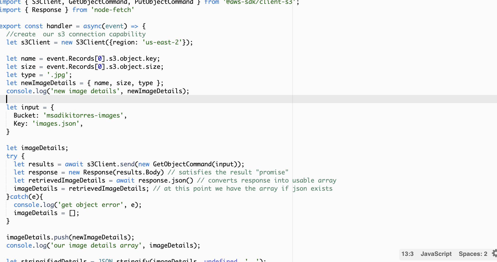

# LAB - Class 17

## Project: lambda

### Author:  Malik Sadiki-Torres

### Problem Domain

Run image processing pn files after they're uploaded to an S3 Bucket

### Process

- Create bucket within in S3
- Then within lambda added trigget and functions
- Provided IAM with the correct role access permissions
- Then uploaded image to test

I was unable to generate a new image.json file when I reuploaded the images.

### Links and Resources

[ImageJSON](https://msadikitorres-images.s3.us-east-2.amazonaws.com/images.json)

### Collaborators

I referenced the demo video and the lecture md

### Setup

#### `.env` requirements (where applicable)

#### How to initialize/run your application (where applicable)

#### Routes

#### Tests

#### UML

