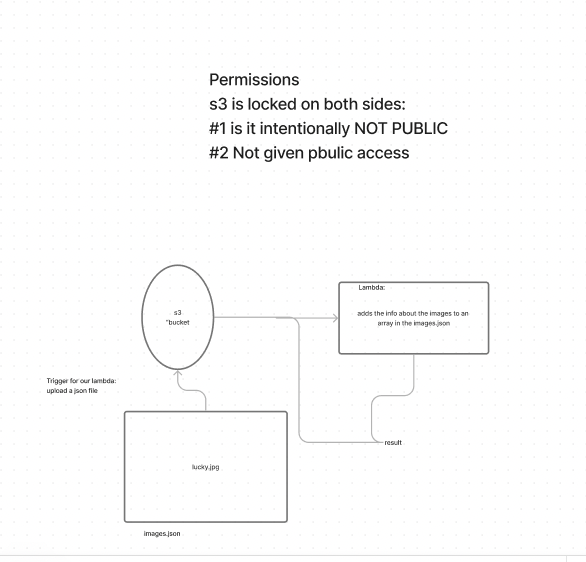

# LAB - Class 17

## Project: lambda

### Author:  Malik Sadiki-Torres

### Problem Domain

Run image processing pn files after they're uploaded to an S3 Bucket

### Process

### Links and Resources

### Collaborators
I referenced the demo video and the lecture md

### Setup

#### `.env` requirements (where applicable)

#### How to initialize/run your application (where applicable)

#### Routes

#### Tests

#### UML

